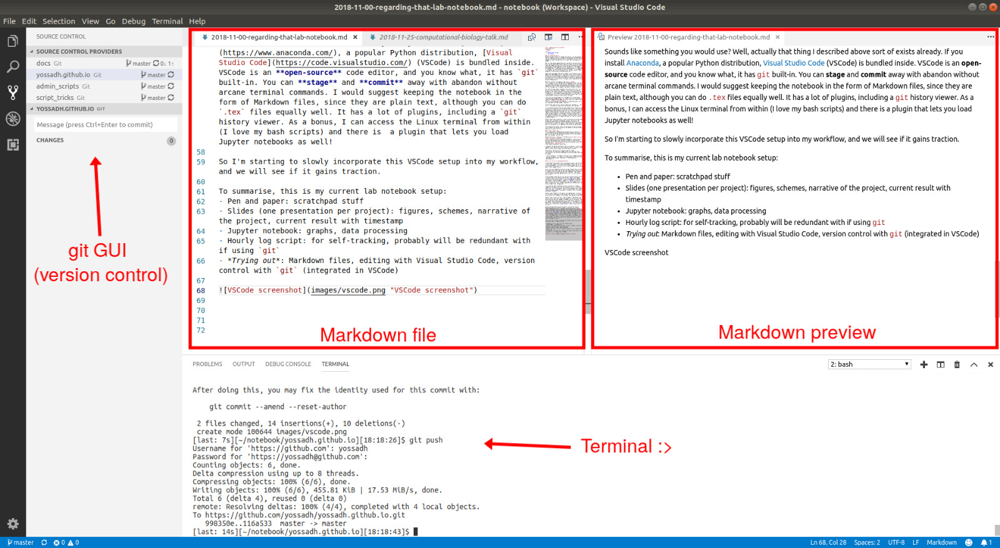

### Lab notebooking and me
Whether one does research in academia and industry, the lab notebook is a constant companion. In fact, in industry the notebook recording would be even more enforced and regulated due to IP and patent and stuff, while in academia it tends to be more lax; or at least that is my impression anyway.

Now, for those doing computational work, how best to log and record our work? The wet lab notebook is definitely not a good fit, since we have some code snippets here and there, which are not so amenable to longhand. In my initial PhD years doing structural biology work, I was happy to adopt OneNote at the suggestion of my PI, who was a fan. It worked fine, but somehow when I transitioned to more computational work, I abandoned it. Perhaps it is too bloated with features. Perhaps it's the change to Linux desktop. But there is the web version, you say; I know, I know, perhaps it's just my lack of discipline after all...

Anyway, during my latter PhD years in Sweden I reverted back to pen and paper, plus some README files at the project folders. And this mostly worked fine, but looking back, I wondered how in the world I could find all my results back if asked by a reviewer or an auditor? I didn't worry much about this since all my work during this time are already published, but I do wonder if in the future I can adopt a more organised and robust method of documentation.

With this in mind, I was happy to find [Jupyter notebook](http://jupyter.org/) in the beginning of my postdoc earlier this year. It is a notebook in which one can mix text (Markdown format, plus html and LaTeX if you need them) and executable code snippets -- perfect for computational work, right? A few months ago I would nod enthusiastically, but here I am again with no update to my Jupyter notebook for months. 

Don't get me wrong, Jupyter notebook is very useful and I still use it, but not for my *big picture* notebook. I find it better to have one notebook of say, a particular data processing from raw data with some docking scores, to pretty graphs, to final selection to be passed on to a collaborator. I think Jupyter notebook would better fit work that is more scripting-heavy e.g. non-structural bioinformatics and/or deals with an enormous amount of data e.g. data science, astronomy.

I also still use pen and paper for scratchpad stuff: brainstorming, sketching ideas, immediate todo list, doubts, and other unpolished stuff. I would not abandon pen and paper yet, since the current research says that [pen is mightier than the keyboard](https://journals.sagepub.com/doi/abs/10.1177/0956797614524581) (but I will copy-paste that code snippet, thank you). 

Interestingly, what sticks for me as a big picture notebook is... wait for it... presentation slides! Wait, wait go back, don't go away. 

I've learned during my PhD that my weekly update with my supervisor keep me on my toes and give me focus on the direction to go. I think putting my progress in slides puts me in that state of mind of preparing to do progress update meeting with my supervisor, so it forces me to create a logical narrative and spot the holes. As a bonus, that work progress slide you need to make for lab meeting? You now will always have it on hand, constantly updated. In restrospect, this makes the most sense -- you log and record your work in a notebook, then translate it to slides to communicate it to your colleagues and supervisor; why not skip the notebook altogether?

Another thing I want to mention, is that I also have a script that nags me every hour to log what I am doing at the hour, with the script automatically generating the timestamp. Besides jolting me out of procrastination, it helps me track of the distribution of work among the projects over the weeks, for example. I keep the entries simple, and I don't fill every hour, so it comes down to a few entries per workday. 

If you would like a similar setup, you can easily set one by setting hourly reminder and log the entries in your Google or Outlook calendar (I keep mine in a plain text file). 

### Is there a better way?  
Curious about better notebook options and what other scientists are using, first I asked around my computational group colleagues, and they generally also do not have any specialised ELN, but the usual OneNote, gDoc, pen and paper, and the likes.

Researching online, I came across this Nature article <[How to pick an electronic laboratory notebook](https://www.nature.com/articles/d41586-018-05895-3)>, which from the get-go already assumes that traditional notebook is cumbersome and electronic lab notebook (ELN) is definitely the future, but there are so many ELN options -- how to choose? (If you are interested, one of the references has [a comprehensive list](http://www.atriumresearch.com/eln.html).)

I looked at the options mentioned in the article and well, I don't know, somehow I am turned off by all the commercial options. I think the ideal ELN for science should be open-source like Jupyter notebook.

One workflow from the article resonates with me, though --
> Every month, his team exports pages to PDF files and signs them electronically; the files are then moved to a directory where they cannot be changed.

 I like it because it lets people to use any form of notebook they want (even pen and paper!), as long as it is exportable to PDF, and at the same time fulfilling audit requirement of timestamping and non-editability.

### Version control as timestamping and more

I would submit that a better (but not necessarily easier) way to do this is to borrow a concept from software development, version control. In software development, the version control software keeps track of the source code of the project. It is a sort of more sophisticated version of Word's *track changes* feature.

In our case, our notebook *is* the source code. Indeed, there are others who have the same idea. Googling 'git lab notebook' gives several hits, for example [this one](https://github.com/tlnagy/jekyll-lab-notebook) is centred around the calendar days and lives in GitHub.  (The version control software that I am familiar with is `git`, so I will mention `git` a lot.)

I shall attempt to describe the `git` version control workflow: You work on a project which has features A and B; you **stage** the changes related to feature A and **commit**, thus timestamping and logging it in the timeline; you do the same for feature B. **Staging** is precisely for this purpose, to bundle together changes in a logically-structured manner. The version control software only saves the changed files (`git` saves the whole file, other softwares may save only the difference), so this is a good thing, storage-wise. 

In this way you would accumulate a linear collections of timepoint snapshots (branching in the timeline is possible but let's exclude it for simplicity), in which you have a record of every change in your notebook (isn't this like... blockchain?). Even if you go back and revert some changes you make because of a mistake for instance, that is recorded as yet another **commit**. 

Sounds arcane? Probably to the typical (non-computational) scientists, all this sounds cumbersome to learn and get into. Even for me, typing all those obscure `git` commands to the terminal take sometime to get used to.

Ideally, they (I'm not sure who... kind strangers?) should make `git` version control more user-friendly and simpler for the user (nice GUI; and we can also skip the staging for example) and for the auditor (they can see the whole timeline and there is a slider button to quickly review all changes), and I think many would gladly use it. The weakness of this approach is, the ELN needs to be largely plain text (just like a software source code), otherwise the changes between **commits** may be difficult to view. 

Sounds like something you would use? Well, actually that thing I described above sort of exists already. If you install [Anaconda](https://www.anaconda.com/), a popular Python distribution, [Visual Studio Code](https://code.visualstudio.com/) (VSCode) is bundled inside. VSCode is an **open-source** code editor, and you know what, it has `git` built-in. You can **stage** and **commit** away with abandon without arcane terminal commands. I would suggest keeping the notebook in the form of Markdown files, since they are plain text, although you can do `.tex` files equally well. It has a lot of plugins, including a `git` history viewer. As a bonus, I can access the Linux terminal from within (I love my bash scripts) and there is  a plugin that lets you load Jupyter notebooks as well! 

So I'm starting to slowly incorporate this VSCode setup into my workflow, and we will see if it gains traction.

To summarise, this is my current lab notebook setup:
- Pen and paper: scratchpad stuff
- Slides (one presentation per project): figures, schemes, narrative of the project, current result with timestamp
- Jupyter notebook: graphs, data processing
- Hourly log script: for self-tracking, probably will be redundant if using `git` 
- *Trying out*: Markdown files, editing with Visual Studio Code, version control with `git` (integrated in VSCode)  
  (see screenshot below)

